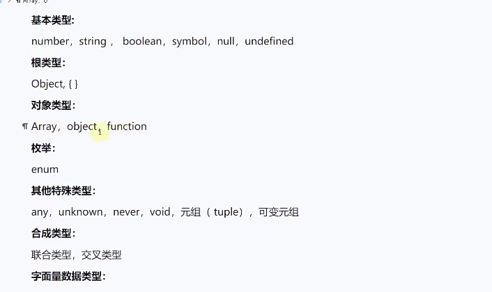
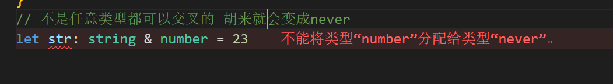
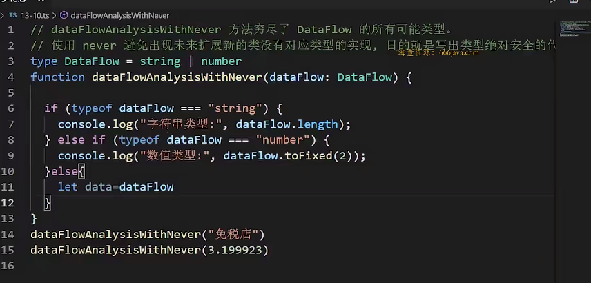
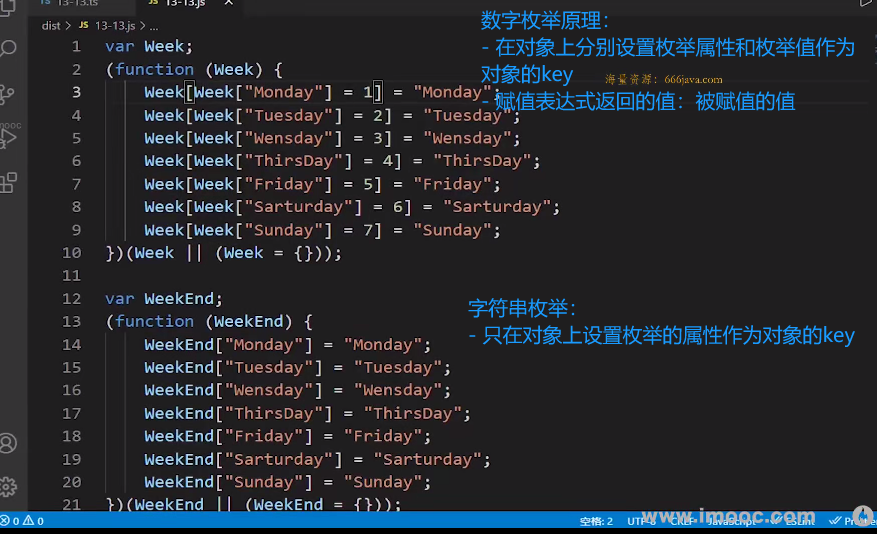
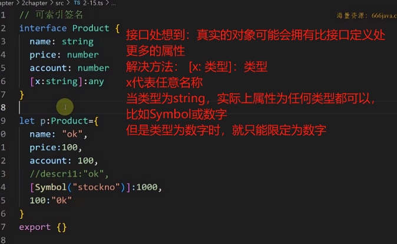

# ts核心语法

## 引言

- ts定义：融合了后端面向对象思想的超级版`JavaScript`语言

- 环境搭建：

  ```sh
  npm init -y
  npm i typescript -D
  # 生成ts的配置文件
  tsc --init
  ```

- `TypeScript`优势：

  - 编译时静态类型检测：如使用错了类型会有红色的波浪线报错

  - 自动提示**更加清晰明确**：

    如定义了一个对象，使用该对象时写到.会**只提示当前自动定义的属性**

    而`JS`中会提示自定义和原型上的属性

  - 引入了泛型和一系列TS特有的类型

  - 强大的`d.ts`**声明文件**

  - 轻松编译成`js`文件

  - 灵活性高：尽管是强类型，但也提供了`any`和`as any`断言

## 类型注解和推导

```ts
// 类型注解
let data:number = 3;
data = '123'

// 类型推导
let money= '123';
money = a;
```

- **区分**类型注解和类型推导：

  - 在定义时刻的固化

    - 类型注解在定义时就只能使用给定的类型

    -  类型推导再后续重新赋值时检测类型

## ts文件运行

- 现象：在`node`和浏览器中均不能直接运行`ts`文件

- 解决方法：

  - 使用`tsc ts文件名`编译得到同名`js`文件，运行`js`文件

    - 建议：修改`tsconfig`，将编译后得到的`js`文件放在专门的目录下,不混淆

      ```json
      "rootDir": "./allchapter/2chapter/src",       
      "outDir": "./allchapter/2chapter/dist",   
      ```

  - 使用`tsc`则编译所有`ts`文件
  
  - 使用`ts-node` 直接运行`ts`文件

> **细节**
>
> - 问题: 不同的ts文件中不能声明两个相同名称的变量
>
> - 原因：ts会默认将所有ts文件的变量放在一个全局作用域下,而不是自己文件的作用域下
>
> - 解决方法：使用`export {}`，改变变量的作用域为当前文件

## ts常用24种数据类型



- `undefined`和`null`不能复制给根类型`Object、{}`,其他都可以

- 区分小`object`和`Object`

  - 小`object`只能接受基本对象类型
  - 大`Object`是任何类型的根类型

- 联合类型：符号`|`，允许接受**联合类型中某一种类型的值**

- 交叉类型：符号`&`，必须包含前面交叉类型中**每个类型所有值**

  

  ```ts
  // 交叉类型
  type obj1 = { username: string};
  type obj2 = { age: number};
  const obj: obj1 & obj2 = {
    username: '张三',
    age: 46
  }
  ```

  > - `{}`中是否写`key value`的区别非常大
  >
  >   - 什么都不写就是根类型
  >
  >   - 写了`key vlaue`就是指定了基本对象类型，简称对象数据类型
  
  > - 交叉类型
  >   - 基本类型不能交叉会变成Never
  >   - 如果两个基本对象类型有重名属性且不同类型，交叉后会变成`never`

- 字面量类型：`type`指定能够使用的字面量值，范围更小更精确

- `never`使用场景：

  避免未来出现新的类型而没有对应的类型的操作，目的是**写出绝对安全的代码**

  

- 枚举：使用`enum`定义，用来存放固定常量的序列

  

  - 数字枚举：

    - 只需要给第一项数值，后面的都会递增
    - 枚举具有双重映射：可以从`key`到`value`，也可以从`value`到`key`
      - 原理：转换成`js`后，会在对象上新增枚举对象的`key`和`value`的属性

  - 字符串枚举：

    - 每一项都需要赋值
    - **枚举只能像对象那样映射，通过`key`获得`value`**，<font color=red>不是双重映射</font>

    > **枚举好处**
    >
    > - 有默认值和递增至，节省编码时间
    > - 语义清晰，可读性强

- `any`和`unknown`

  - 相同点：`any`和`unkown`可以做任何类型的父类，**即任意类型都可以赋值给`any`和`unkown`类型**

  - 不同点

    - `any`类型可以做任何类型的子类，**即`any`类型可以赋值给任意类型**

    但是`unknown`不可以赋值给其他类型

    - 可以使用.语法或[]语法获取`any`类型的属性或方法，但是不能获取`unkonwn`类型的属性或方法

  > **注意**
  >
  > 此处所说的父类就是可以写在赋值号左边，子类就是可以写在赋值号右边

  - 常用场景：

    - `any`
      - 自定义守卫
      - 需要进行`as any`类型断言的场景
    - `unknown`
      - 函数参数:用来接收任意类型的实参，**且在函数内部只用于再次传输或输出结果，不获取属性或方法的场景**

- 接口

  - 是什么： 定义**另一种对象类型**的类型

    > `type`和`interface`都可以定义对象类型

  - 注意：接口中的**属性**和**方法**都<font color=red>只有声明，没有实现</font>。即不写花括号

  - 可以使用`type`定义对象类型，为什么要是使用接口呢?

    - 接口可以`extends`继承，而`type`不行

    - 为多个同类别的**类**提供统一的属性和方法声明

      比如`Arr`和`String`都是`toString、valueOf`等相同的方法名

      且在编译器中可以直接点击类名左上角的小灯泡，编译器就可以自动填充实现

  - 常见场景：
    - 第三方包或框架底层有大量接口类型
    - 在函数或方法的为 对象类型的参数时使用
    - 实现同类别的类`implements`

  - 接口用于定义对象类型，如果接口现在定义了一组明确的属性，将来对象可能会增加一些额外的属性，应该怎么解决呢？<font color=red>可索引属性签名</font>

    

  - **索引属性签名**允许对象处使用接口没有明确指明的属性。

    <font color>可索引签名一定要兼容已经写了确定名称的属性</font>

    ```ts
    interface Product {
        name: string,
        // [x: string]: number, // 错误 这种写法不兼容name属性
        [x: string]: string | number, // 正确
    }
    ```

    > **建议**
    >
    > 如果不明确索引属性签名的值类型，写成`any`比较保险，不用考虑类型兼容。
    >
    > 如果确定了那就写确定的，然后还要考虑兼容性。

  - **索引访问类型**  <font color=red>理解其他复杂类型的基础</font>

    - **同名**接口自动合并，同时拥有不同位置处的多个不同名属性。
    - 

--

看到16节
