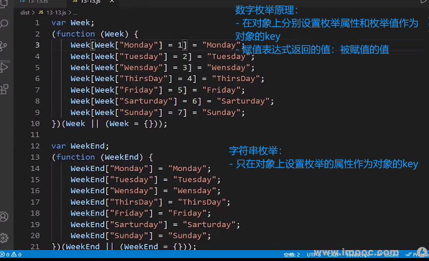

# ts核心语法

## 引言

- ts定义：融合了后端面向对象思想的超级版`JavaScript`语言

- 环境搭建：

  ```sh
  npm init -y
  npm i typescript -D
  # 生成ts的配置文件
  tsc --init
  ```

- `TypeScript`优势：

  - 编译时静态类型检测：如使用错了类型会有红色的波浪线报错

  - 自动提示**更加清晰明确**：

    如定义了一个对象，使用该对象时写到.会**只提示当前自动定义的属性**

    而`JS`中会提示自定义和原型上的属性

  - 引入了泛型和一系列TS特有的类型

  - 强大的`d.ts`**声明文件**

  - 轻松编译成`js`文件

  - 灵活性高：尽管是强类型，但也提供了`any`和`as any`断言

## 类型注解和推导

```ts
// 类型注解
let data:number = 3;
data = '123'

// 类型推导
let money= '123';
money = a;
```

- **区分**类型注解和类型推导：

  - 在定义时刻的固化

    - 类型注解在定义时就只能使用给定的类型

    - 类型推导再后续重新赋值时检测类型

## ts文件运行

- 现象：在`node`和浏览器中均不能直接运行`ts`文件

- 解决方法：

  - 使用`tsc ts文件名`编译得到同名`js`文件，运行`js`文件

    - 建议：修改`tsconfig`，将编译后得到的`js`文件放在专门的目录下,不混淆

      ```json
      "rootDir": "./allchapter/2chapter/src",       
      "outDir": "./allchapter/2chapter/dist",   
      ```

  - 使用`tsc`则编译所有`ts`文件

  - 使用`ts-node` 直接运行`ts`文件

> **细节**
>
> - 问题: 不同的ts文件中不能声明两个相同名称的变量
>
> - 原因：ts会默认将所有ts文件的变量放在一个全局作用域下,而不是自己文件的作用域下
>
> - 解决方法：使用`export {}`，改变变量的作用域为当前文件

## ts常用24种数据类型

- 基本类型：

  `string`、`number`、`boolean`、`symbol`、`bigint`、`null`、`undefined`

- 根类型：`Object`和`{}`

- 对象类型：`array`、  `object`、`function`、

- 特殊类型：`any`、`unknow`、`void`、`never`、`Enum`(枚举)  、`Tuple`(元组)、可变元组
- 合成类型：联合类型、交叉类型
- 字面量类型

- 类型推理

### `Object`和`object`

- 大`Object`（等价于`{}`）是任何类型的根类型

  除了`null`和`undefined`不能复制给根类型

- 小`object`只能接受**基本对象类型**

  - 使用`object`可以定义一个对象类型

    注意：**使用`.`会报错**

    原因：**小`object`没有限制对象内部的具体属性；ts编译器首先去`object`上查找对应的属性名,但是找不到所以报错**

    ```ts
    let obj1: object = { a: 1, b: 2}
    obj1.a // error 类型上不存在该属性
    obj1.a = 3 // error 类型上不存在该属性
    ```

  - 想要更改属性值的解决方法

    使用含有`key:value`的`{}`定义对象的类型

    ```ts
    let obj2: { a: number, b: number } = {a: 1, b: 2}
    obj2.a = 3 // ok
    ```

> **注意**：`{}`作为类型，其中是否写`key value`的区别非常大
>
> - 什么都不写就是根类型
>
> - 写了`key vlaue`就是指定了基本对象类型，简称对象数据类型

### 联合类型

- 符号`|`，数据取值可以为多种类型中的一种

  ```ts
  // a可以取number或sring
  let a: number | string
  ```

### 交叉类型

- 符号`&`，将多种类型合并为一个类型

  ```ts
  type type1 = { username: string};
  type type2 = { age: number};
  const obj: type1 & type2 = {
    username: '张三',
    age: 46
  }
  ```

- 交叉规则

  - 同名**基础属性**不同类型

    合并后没有意义会变成`never`类型，如`string & number`就会变成`never`

    

  - 同名属性相同类型，合并后的类型也是源类型

  - 同名**非基础属性合并**

    ```ts
    interface A { a: number }
    interface B { b: string } // 如果这里面也是a,那么合并会变成同名基础属性合并会变成never
    
    interface C {
        x: A
    }
    interface D {
        x: B
    }
    type allProps = C & D
    
    const Info: allProps = {
      x: {
        a: 7,
        b: '小杜杜'
      }
    }
    
    console.log(Info) // { x: { "a": 7, "b": "小杜杜" }}
    ```

    对于混入多个类型时,若存在相同的成员,且成员类型为非基本数据类型,可以成功合并。

### 字面量类型

- 使用方法

  * 使用`type`关键字定义类型，赋值号右侧为定义的字面量类型，范围更小更精确

  * 直接将字面量类型写在`变量: 字面量类型`

    ```ts
    let str:'小杜杜' 
    let num: 1 | 2 | 3 = 1
    let flag:true
    ```

- 现在支持：字符串、数字、布尔

### `never`

- 作用：避免未来出现新的类型而没有对应的类型的操作，目的是**写出绝对安全的代码**

  

- 场景：

  - 函数返回值处代表函数不存在返回值，哪怕是`undefined`也不返回

    函数返回值处写`void`会返回`undefined`

  - 变量如果是`never`类型则不能赋值

- 符合的情况：

  - 函数抛出异常，`throw new Error('reason')`函数返回值类型可以写`never`
  - 无限死循环：函数体内有一个无限死循环，就可以写`never`

  ```ts
  let error = ():never => { // 等价约 let error = () => {}
    throw new Error("error");
  };
  
  let error1 = ():never => {
    while(true){}
  }
  ```

### 枚举类型

- 作用：可以定义一些带名字的常量以**清晰表达意图**

- 优势：

  - 有默认值和递增值，节省编码时间

  - 语义清晰，可读性强

- 语法：使用`enum`，用来存放固定常量的序列

#### 数字枚举：

- 只需要给第一项数值，后面的都会递增

- 枚举具有双重映射：可以从`key`到`value`，也可以从`value`到`key`

  - 原理：转换成`js`后，会在对象上新增枚举对象的`key`和`value`的属性

    

#### 字符串枚举：

- 每一项都需要赋值
- **枚举只能像对象那样映射，通过`key`获得`value`**，<font color=red>不是双重映射</font>

### `any`和`unknown`

- 相同点：

  `any`和`unkown`可以做任何类型的父类，**即任意类型都可以赋值给`any`和`unkown`类型**

- 不同点

  - `any`类型可以做任何类型的子类，**即`any`类型可以赋值给任意类型**；

    但是`unknown`不可以赋值给其他类型

  - 可以使用.语法或[]语法获取`any`类型的属性或方法，但是不能获取`unkonwn`类型的属性或方法

> **注意**：此处所说的父类就是可以写在赋值号左边，子类就是可以写在赋值号右边

- 常用场景：

  - `any`
    - 自定义守卫
    - 需要进行`as any`类型断言的场景
  - `unknown`
    - 函数参数:用来接收任意类型的实参，**且在函数内部只用于再次传输或输出结果，不获取属性或方法的场景**

### 接口

- 是什么： 定义**另一种对象类型**的类型，也可以定义**函数类型，即函数型接口**

  > `type`和`interface`都可以定义对象类型

- 注意：接口中的**属性**和**方法**都<font color=red>只有声明，没有实现</font>。即不写花括号

- 可以使用`type`定义对象类型，为什么要是使用接口呢?

  - 接口可以`extends`继承，而`type`不行

  - 为多个同类别的**类**提供统一的属性和方法声明

    比如`Arr`和`String`都是`toString、valueOf`等相同的方法名

    且在编译器中可以直接点击类名左上角的小灯泡，编译器就可以自动填充实现

- 常见场景：

  - 第三方包或框架底层有大量接口类型
  - 在函数或方法的为 对象类型的参数时使用
  - 实现同类别的类`implements`

- 接口用于定义对象类型，如果接口现在定义了一组明确的属性，将来对象可能会增加一些额外的属性，应该怎么解决呢？

  <font color=red>可索引属性签名</font>

  

### **索引属性签名**

- 允许对象处使用接口没有明确指明的属性名

- <font color=red>可索引签名一定要兼容已经写了确定名称的属性</font>

```ts
interface Product {
    name: string,
    // [x: string]: number, // 错误 这种写法不兼容name属性
    [x: string]: string | number, // 正确
}
```

> **建议**
>
> 如果不明确索引属性签名的值类型，写成`any`比较保险，不用考虑类型兼容。
>
> 如果确定了那就写确定的，然后还要考虑兼容性。

### **索引类型查询**  

<font color=red>理解其他复杂类型的基础</font>

- **同名**接口会自动合并
  - 对于不同名属性，这个接口同时具有这些属性
  - 相同属性、相同类型，保留一个
  - 相同属性，不同类型，无法合并会报错

> 当讲一个`const`声明的常量作为Interface的属性时，会将这个常量解释为他所对应类型推导得到的字面量类型（可以使用`typeof  `获得），而不是这个变量名称本身。
>
> `typeof`后面接变量
>
> ```ts
> // let a = 3; // interface不能使用let声明的变量
> const b = '6';
> interface Test {
> name: '张三',
> [b]: number | '哈哈哈',
> }
> type name1 = Test['name']
> type b1 = Test[typeof b]
> type b2 = Test['6']
> // 在 TypeScript 中，直接使用常量 b 作为接口属性名，TypeScript 会将其解释为字面量类型而不是变量
> // 而使用const 类型推导得到的值由是原始赋值
> // Test[typeof b] 中的 typeof b 将得到字面量类型 6，而不是变量 b 所代表的值。
> 
> ```

`keyOf`:

`keyOf`后面接类型，获得所有的属性名称。

补充：当一个字面量充当类型时，这个类型就是他的值本身。

### 区分`null`和`undefined`

- 一般情况下，想要给某个变量赋值`undefined`，必须在前面指定其可以为`undefined`类型；否则`ts`报错

  > 可以在tsconfig.json中修改配置，不检查空值赋值，但是不建议这么做

- undefined应用：如果函数声明时，允许不传实参怎么写

  建议使用`?：`这个语法，这样可以

  ```ts
  // ?的作用
  // 1.把 data类型解析为： string | undefined
  // 2.允许函数调用时不传递这个参数,即变为可选参数，可以不写
  function fn(data ?: string){
      // pass
  }
  fn() // 不写任何东西也不报错
  
  // 
  function fn(data: undefined| string ) {
      // Pass
  }
  fn() // 什么都不写ts会报错
  fn(undefined) // 必须手动传递data支持的类型的数据
  ```

  ```ts
  // 使用了？：语法，使参数变成了可选参数.那么在函数体里面还可以调用这个可选参数的方法吗？
  function fn(data ?: string){
      // 直接使用会提示错误, 可能未定义
      data.toString();
      // 解决方法1
      if(data) data.toString(); // 不报错,手动判断了下
      // 解决方法2
      data!.toString(); // 它用于告诉编译器，你确信某个表达式的值不会为 null 或 undefined，从而取消 TypeScript 的类型检查。这在你确定某个值不会为空的情况下使用，以避免编译器的类型检查报错。
  }
  fn() // 不写任何东西也不报错
  ```

  

- 哪些数据类型可以接受`undefind`?

  any、unknow、undefined

- 哪些类型可以接受`null`

  any、unknow、undefined


- <font color=red>易错点</font>

  - 类型推断：推断可用的最小范围的类型，const和let的表现不同

  - 访问已知结构的对象的属性

    可以使用字面量和const声明的常量

  - 不能访问`object`类型声明的对象的的任何属性和方法

### 函数类型

- 调用函数时，传递的实参不能多于形参，且传递的参数的顺序必须一致

- 函数声明

- 函数表达式

  - 前提：类型都是约束给赋值号左侧的

  - 函数声明

    直接给给函数的形参、返回值处写明类型

  - 在函数表达式中，是将一个函数赋值给了一个变量,**实际是给该变量指定类型**

    1. 方法1：直接指定该变量的类型为 `形参类型列表 => 返回值类型`;

       无需给右侧函数指定类型，**但是需要保证右侧函数的函数体尽可能满足左侧变量定义的类型**

       ```ts
       let info: (name: string, age: number) => string = function(name, age) {
       	return '字符串'
       }
       ```

    2. 方法2：类似方法1，只不过只用先定义类型

    3. 方法3：不给左侧变量变量，给右侧函数形参、返回值定义，左侧变量会自动推断类型；不建议

- `rest`参数

  需求：如果有确定的属性名和类型，但是还有不确定的一些属性名，该怎么办？

  使用`rest`参数

  ```ts
  // 如果确定这些不确定属性名的类型,就写具体类型 
  // 不确定就写 any
  function info(name: string, ...rest: any) {
  	return rest
  }
  ```


### 函数类型解构

- 使用场景：

  - 当只需要使用传入的**对象部分属性时** 

  - 简化传入的参数在函数体中的写法

- 语法：在函数定义的形参处进行解构

  ```ts
  type InfoType = {
    name: string,
    age: number,
  }
  // 原方法：在函数体内部需要写全
  function getInfo(info: InfoType) {
    // 函数体中只需要使用name
    console.info(info.name);
  } 
  // 修改点：函数解构
  function getSubInfo({ name }: InfoType) { 
    console.info(name)
  }
  let objInfo = {
    name: 'pp',
    age: 24,
  }
  getInfo(objInfo);
  getSubInfo(objInfo);
  ```

### interface和type区别

- 定义类型范围：
  - `interface`：**只能定义** 1.对象类型 **2.接口当做名字的函数类型**
  - `type`：可以**定义任何类型**，基础类型、`|`联合类型、`&`交叉类型、元组。

- 继承性

  - `interface`: 

    可以`extends`继承一个或多个<font color=red>接口或类型</font>，也可以继承`type`；不过继承多个接口并不常见，继承`type`也并不常见

  - `type`: 无继承

- 是否可以交叉`&`,得到新的类型

  - `type`可以
  - `interface`不可以

- 声明是否可合并

  - `type`:定义两个同名的会出现编译错误
  - `interface`:定义连个同名的接口会**自动合并**

> 使用类型的建议：

- <font color=red>如果要定义对象，大概率使用接口</font>

  - 可以继承

  - 可以合并

    场景：如有想在`ts`底层类中添加一些自己的属性，那么只需要重写这个类即；编译器会自动合并，此时这个接口就包含了底层属性和自己自定义的属性

### 元组

#### 固定元组

- 特殊的数组

  - 赋值号左侧:定义时每个元素类型确定

  - 赋值号右侧：<font color=red>数据的个数和类型</font>必须和定义的类型保持一致

  ```ts
  const tuple: [string, number, number] = ['pp', 170, 55]
  ```

- <font color=red>获得元组的值</font>

  ```ts
  // 类似数组的方法
  const tuple: [string, number, number] = ['pp', 170, 55]
  tuple[0]
  tuple[1]
  tuple[2]
  ```

#### 可变元组：

- 需求：有些元素的类型和个数固定，但是有些是不固定，怎么办？

  - 数组可以吗？

    不行，因为数组是所有元素都遵守同一个类型，无法做差异化控制某个类型。

  - 解决方案：可变元素，数组和元素的结合版，<font color=red>既有元组的固定类型和个数的特点，又有数组灵活的特点</font>

- 语法：`...any[]`

  ```ts
  // 可变元组
  const customers: [string, number, number, ...any[]] = 
  ['pp', 170, 55, '广东省广州市', 'xx大学']
  ```

- <font color=red>获得可变元组的固定值和可变值</font>：**解构取值**

  ```ts
  // 如何解构获得各个元素
  const [name, height, weight, ...rest]: [string, number, number, ...any[]] = ['pp', 170, 55, '广东省广州市', '暨南大学']
  console.info(rest) // ['广东省广州市', 'xx大学']
  ```

- <font color=red>可变元组标签</font>：**作用很大，指明了可变元组该元素的含义**

  - 在类型处，每个元素的类型前面写标签

  - 标签名可以和解构名不同，但是建议: <font color=red>标签名 为 解构名添加一个下划线</font>
  - 注意：**可变元素的标签的写法**

  ```ts
  let [name, height, weight, ...rest]: [name_: string, height_: number, weight_: number, ...rest:any[]] = ['pp', 170, 55, '广东省广州市', 'xx大学']
  ```

### 数组和数组元素同时为只读

- 数组不可改变：

  - 使用`const`声明数组后，就不可以重新使用赋值符号为数组变量重新赋值
  - 但是依旧可以使用`arr[index]`修改数组元素的值

- 数组元素不可以改变：

  - `as const`关键词，让数组元素也不可以改变

    ```ts
    const arr = [1, 2, 3, 4,] as const
    arr[0] = 6 // 报错,试图改变不可改变的元素
    ```

### 类、静态属性

- `es6`面向对象的思想还不那么彻底，比如想让一个属性变为私有就和你复杂

#### 类定义

- 定义：<font color=red>拥有相同属性和方法的一系列对象的集合</font>
  - 类是模板、结构，是从这个类包含的一系列对象中**抽象出来的结构**，
  - 类**定义**了它所包含的全体对象的静态特征（属性）和动态特征（方法）

#### es5实现类

- 使用构造函数完成类功能

- 实例属性直接定义在构造函数中，使用`this.xxx = 形参`的方式

  在实例方法中使用`this.xxx`访问

- 实例方法挂在在构造函数的`prototype`属性上

  因为所有的对象的方法都是一样的，只存储在一个`prototype`上，而不是都保存子啊自己的实例上，可以节省内存空间 

- 静态属性 使用`构造函数名.xxx = xxx`定义

  在静态方法和实例方法中 使用`构造函数名.xxx`来访问

- 静态方法：使用`构造函数名.xxx = function() {}`来定义

```ts
// es5实现类
function MyClassES5(name) {
  this.name = name // 实例属性
  MyClassES5.count ++;// 调用静态属性
};
// 实例方法 右侧为匿名函数
MyClassES5.prototype.getName = function() {
  return this.name
}

// 静态属性
MyClassES5.count = 0;
// 静态方法
MyClassES5.getCount = function() {
  return MyClassES5.count;
}

const n1 = new MyClassES5('pp');
console.info(MyClassES5.getCount())
const n2 = new MyClassES5('test')
console.info(MyClassES5.getCount())
```

#### es6实现类

- 使用`class`定义整个类，所有的内容都是写在`class`

- 实例属性：使用构造函数`constructor`定义和接收

- 实例方法：直接写在`class`内部，建议以对象方法的方式简写

- 静态属性：`static 变量名 = xxx`

  在静态方法和实例方法中使用`类名.静态属性名`来访问

- 静态方法：直接写在`class`内部，`static 对象方法`

```js
// es6
class MyClassES6 {
  constructor(name) {
    this.name = name // 实例属性
    MyClassES6.count++;// 调用静态属性
  }
  // 实例方法
  getName() {
    return this.name
  }
  // 静态属性
  static count = 0;
  // 静态方法
  static getCount() {
    return MyClassES6.count;
  }

}
const n1 = new MyClassES6('pp');
console.info(n1.getName());
console.info(MyClassES6.getCount())
const n2 = new MyClassES6('test')
console.info(n2.getName());
console.info(MyClassES6.getCount())
```

#### `ts`实现类

- 与`es6`相比,`ts`新增了<font color=red>实例属性的类型注解，`实例属性名： 类型`</font>

```ts
// ts中的写法
class MyClassTS {
  // 新增功能：实例属性的类型注释
  name: string;
  static count: number = 0; // 静态属性
  constructor (name_: string) {
    this.name = name_;
    MyClassTS.count++;
  }
  getName():string {
    return this.name;
  }
  
  // 静态方法
  static getCount():number {
    return MyClassTS.count;
  }
}

const n1 = new MyClassTS('pp');
console.info(n1.getName());
console.info(MyClassTS.getCount());
const n2 = new MyClassTS('test');
console.info(n2.getName());
console.info(MyClassTS.getCount());
```

####什么时候使用静态成员

- 使用场景：

  - 一些**工具类**，如处理日期的工具类。所有的地方静态使用

  - 实例化之后没有用，创建对象会浪费资源、且并不需要创建对象

    但是如果开发者想实例化，也是可以实例化的并不报错。

- 实现

  使用静态成员实现工具类

  ```ts
  // 需要导出整个类给外部使用
  export default class DateUtil {
    static formateDate() {
      console.info('formateDate');
    };
    static diffDateByDay() {
      console.info('diffDateByDay');
    };
  }
  DateUtil.formateDate();
  DateUtil.diffDateByDay();
  ```

- > 静态成员工具类缺点：如果程序员想生成实例化对象还是可以生成，占用内存；存在隐患
  >
  > 工具类也可以使用<font color=red>单例模式</font>；建议使用单例模型 > 全静态成员模式

## ts 单例/件模式的两种实现

- 单例模式是设计模式的一个实现
- 单例模式：<font color=red>只允许外部获取到**类的唯一的 一个实例对象**</font>

### 立即创建单件模式

- 步骤：

  - 私有构造函数，在类内部new实例对象

  - 将工具方法写成实例方法即可

- 特点：

  `ts`解析器遇到到这个类就会立即创建这个类中的实例化的静态对象

  不管程序员是否想使用该类

```ts
// 单例模式
class DateUtil {
  // 私有化构造函数,这样这个构造函数只能在类内部被调用,
  // 即只能在类内部new,在类外部new会报错
  static dateUtil = new DateUtil(); // 立即创建,遇到这个class类就会创建静态成员；
  private constructor() {  };
  // 工具方法写成实例方法
  formateDate() {
    console.info('formateDate');
  };
  diffDateByDay() {
    console.info('diffDateByDay');
  };
}
const dateUtil1 = DateUtil.dateUtil;
const dateUtil2 = DateUtil.dateUtil;
console.info(dateUtil1 === dateUtil2);
dateUtil1.formateDate();
dateUtil1.diffDateByDay();

// 只需要导出这个对象外部即可使用
export DateUtil.dateUtil; 
```

### 方法式创建单件模式

- 步骤

  - 私有化构造函数

  - 声明静态属性的类型：该类，`static dateUtil: DateUtil`

  - 声明静态方法：里面实例化一个类对象为该类的静态属性

    ```ts
      static getInstance() { // 该函数里面还可以写一些其他的操作
        // 静态方法中的this指向类本身
        if(!this.dateUtil) {
          this.dateUtil = new DateUtil();// 只会调用一次构造函数
        }
        return this.dateUtil; // 如果已经创建了就返回旧的
    }  
    ```

  完整代码：

  ```ts
  class DateUtil {
    static dateUtil: DateUtil;
    static getInstance() { // 该函数里面还可以写一些其他的操作
      // 静态方法中的this指向类本身
      if(!this.dateUtil) {
        this.dateUtil = new DateUtil();// 只会调用一次构造函数
      }
      return this.dateUtil; // 如果已经创建了就返回旧的
    }  
    private constructor() {
      console.info('...创建对象');
    }
    // 工具类方法仍然是实例方法
    formateDate() {
      console.info('formateDate');
    };
    diffDateByDay() {
      console.info('diffDateByDay');
    };
  }
  const dateUtil1 = DateUtil.getInstance();
  const dateUtil2 = DateUtil.getInstance();
  dateUtil1.formateDate();
  console.info(dateUtil1 === dateUtil2);
  export { }
  ```

> 区分两种创建单件模式的方法：
>
> - 立即创建：书写简单，但是会马上生成唯一的实例对象
> - 方法：使用时才会创建对象，且可以在方法中定义一些其他操作

>区分静态成员工具类和单件模式：
>
>- 一个借助类来调用；外部使用时，编译器会提示很多其他原型链上的方法
>- 一个借助实例对象来调用；外部使用时，<font color=red>ts仅提示已经定义在该实例对象上的方法</font>

## ts中的getter和setter

### 作用

- 给类实例对象赋值的方法：

  - 直接赋值：

    - 类的花括号最外层写`属性名:类型 = 属性值`

    - **注意，类中直接声明属性和属性值不需要写`let`或`const`关键字**

  - 构造函数：

    - 构造函数中写`this.属性名 = xx`

  - 方法赋值：

    - `setter 属性名() {}`

    - `getter 属性名() {}`

      在花括号中使用在`class`中晟敏给的属性、

    注意：

    - <font color=red>使用方法给一个实例变量赋值，该变量必须已经从初始化并赋值</font>

    - 方法中只能识别到属性声明处、构造函数处是否有赋值；

    - 如果使用方法赋值方式判断传入值是否合法，那么只需要在声明处赋值默认值即可，在构造函数中不要再声明该属性，

    - `class`内部写`getter`和`setter`

      - 外部就使用`.`点语法和`=`赋值符号就会默认分别调用这两个方法
      
      - `getter`和`setter`后的属性不是直接存储数据的，而是给外界访问的接口
      
      - 真正操作的数据存储在另外一个变量中(一般名称为getter和setter后属性名_)
      
      
  
  > - 如果想要判断传入值是否合法，就需要使用第三种方法赋值的方式，在方法中写判断逻辑。
  >
  > - 判断值是否合法的代码不该写在构造函数中，因为不太符合编程规范，

### 代码实现

```ts
class People {
  name: string;
  _age: number = 0;
  constructor(_name: string) {
    this.name = _name;
  }
  get age() {
    return this._age; // 注意get和set提供给外界其后面的标识符;
  }
  set age(val: number) {
    if(val <= 100 && val >= 0) {
      this._age = val;
    } else {
      throw new Error('年龄不在合适范围内')
    }
  }
}

const p1 = new People('pp');
p1.age = 66;
const p2 = new People('pp2');
p2.age = 101;
```

## ts静态成员、方法拦截器

- 需求：

  - 比如要计算每个方法的执行时间、校验每一个方法传递的参数

  - 如果把这些操作写在每一个方法中很费力、很复杂

  - 希望只写一次就可以**对这些方法都应用这些操作**，<font color=red>方法拦截器</font>

- 前置知识

  - `Object.getOwnPropertyDescriptor(obj, prop)`

    - 可以返回**存储**`obj`的`prop`属性的数据属性的**新对象**

    - 数据属性：`value/writable/enumerable/configurable/getter/setter`

    - 每次调用上述方法都会为返回的数据属性开辟新的空间

      - 多次调用返回对象的引用并不相等

      - <font color=red>修改返回的新对象并不会覆盖`obj.prop`这个属性的任何内容</font>

    ```ts
    const dateProp = Object.getOwnPropertyDescriptor(People.prototype, 'doEat');
    const dateProp2 = Object.getOwnPropertyDescriptor(People.prototype, 'doEat');
    console.log(dateProp === dateProp2); // => fasle; 每次都是开辟新的空间
    console.log(dateProp); // => { value: [Function: doEat],writable: true,enumerable: false,configurable: true} 修改内容不会影响源对象的属性
    // console.log(People.prototype); // nodejs环境下为空,nodejs环境下不能直接获取需要通过方法,浏览器环境下不为空
    ```

  - `Object.defineProperty(obj, prop, value)`

    - 给`obj`的`prop`重新赋值为`value`

- 代码实现

  ```ts
  class People {
    name: string;
    age: number;
    addr: string;
    static count: number = 0;
    constructor(_name:string, _age: number, _addr: string){
      this.name = _name;
      this.age = _age;
      this.addr = _addr;
    }
    // 需求:希望在doEat调用前去做一些事情
    doEat(who: string, where: string){
      console.info(`who:${who}, where: ${where}`);
    };
    doDrink() {
  
    };
  }
  
  // 获取源方法,改造
  const dateProp = Object.getOwnPropertyDescriptor(People.prototype, 'doEat');
  const targeMethod = dateProp!.value;
  // 修改dateProp.value并没有修改class中原型上的方法
  dateProp!.value = function(...args: any[]) { 
    console.info('前置拦截');
    targeMethod.apply(this,args); // apply传递数组
    // targeMethod.call(this,args[0], args[1]); // call传递逗号分割的参数列表
    console.info('后置拦截');
  }
  // dateProp!.value('pp', 'beijing'); // 直接调用未通过实例
  
  // 实际使用是通过实例调用实例方法
  // 需要用定义的新方法覆盖原型链上的方法；实现了方法拦截
  Object.defineProperty(People.prototype, 'doEat', dateProp!); // 注意传的是整个dateProp
  let p = new People('pp', 24, '广州');
  p.doEat(p.name, p.addr); // => 前置拦截 who:pp, where: 广州 后置拦截
  export {}
  ```

  


