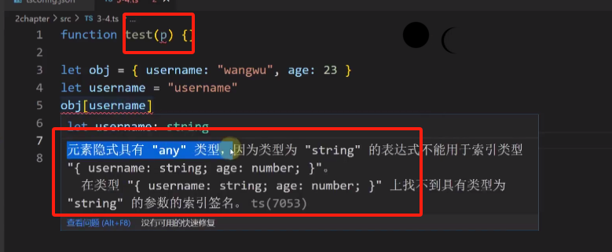

# `tsconfig.json`核心配置

- 学习`tsconfig.json`核心配置和系列相关问题

- `tsconfig.json`最外层有以下四个子选项，默认只显示第一个

## 编译器选项`compilerOptions`

- `target`,  编译`ts`为指定版本的`js`文件

- ` lib: [ESNext, dom] `,  需要提供指定库，才能使用其中的内置方法

  

- `module `,  `ts`编译为`js`后遵守的模块化规范

- `rootDir`,  编译源文件所在目录

- `outDir` ,编译后得到的`js`文件输出目录

- `typeRoots`, 去哪里找第三方包的`.d.ts`声明文件

- `types`, 一般里面只写`node`，就可以使用`node`提供的功能和api

  **此处不需要写第三方包，有一个`node`就足够了**

  **遇到特定的环境，如`vite`会自动添加**

- `allowJs `,  1.是否允许ts文件导入js文件 2.tsc编译ts文件后是否编译js文件

- `checkJs`,  ts编译器是否以ts的规则检查`js`文件

  只有`allowJs`为`true`，该配置项才能设置为`true`

  

- `resolveJsonModule` , 是否支持`import`引入`json`文件

  

- `declaration`,  

  把`ts`文件编译为`js`文件时，会给这个`js`文件生成一个以`.d.ts`结尾的声明文件

  `.d.ts`文件中只有源`js`文件中导出的数据的声明，而没有实现。

- `sourceMap ` 

  `ts`编译为`js`会输出目录下输出目录多出一个`.js.map`文件

  使得我们可以在浏览器调试`ts`文件（浏览器会自动去map ts文件对应的`js`）

  

- `strict`, 1. 是否以严格模式检查`ts` 2.总开关，如果关了下面子项的配置都没用；

  - ``noImplicitAny` ,  对`any`严格检查的选项

    

  - `strictNullChecks`: `undefined`和`null`检查

    保证`undefined`和`null`不能赋值给如`string`等其他类型

  - `strictPropertyInitialization` ，属性初始化值

    如果没有初始化`class`中的属性值会报错，不想报错解决方法：

    - 在属性声明或构造函数处赋值
    - 在属性声明处使用 `?:`或`!:`
    - 关闭`strictPropertyInitialization`校验

  - `noImplicitThis`,  所有分支下都要有`return`返回值

  - `removeComments`,  编译后删除`js`文件中的注释

  - `noUnusedLocals`，声明的变量必须使用

- `skipLibCheck`,  跳过检查`.d.ts`结尾的声明文件类型

  

-  `experimentalDecorators`、`emitDecoratorMetadata` 这两个和后面装饰器有关

  

- `baseUrl`、`paths`， 为导入文件路径提供别名

  `baseUrl`:  工程目录，即整个文件最外层

  `paths`: 

  

  注意：这个别名只在编译时好用，打包时需要配合`webpack`、`vite`等工具。

## 其他选项

略

