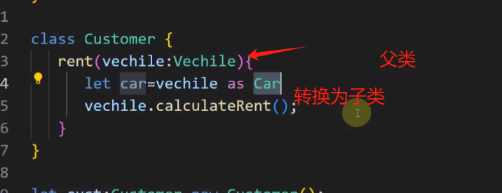
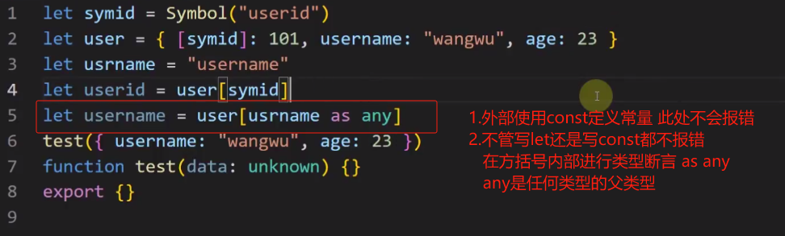
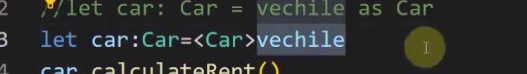
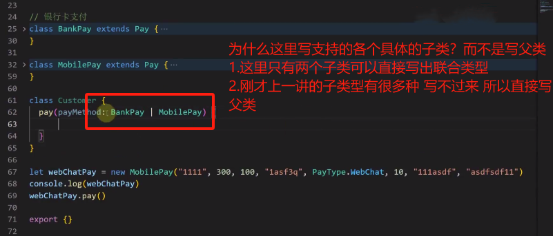
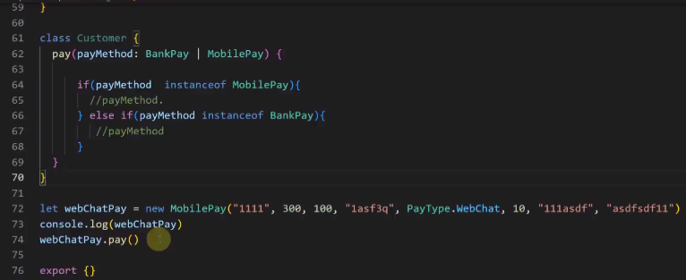
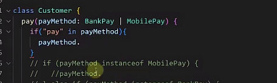
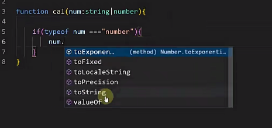
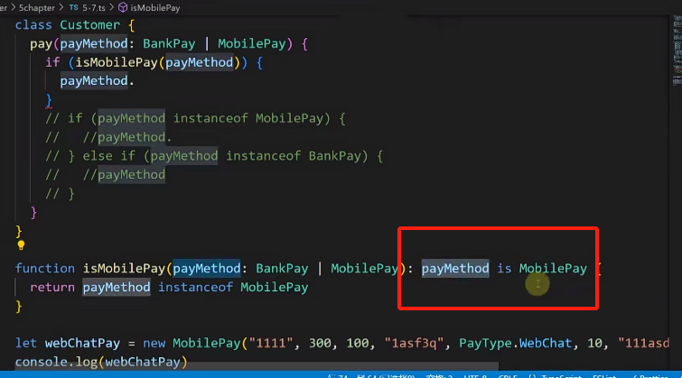
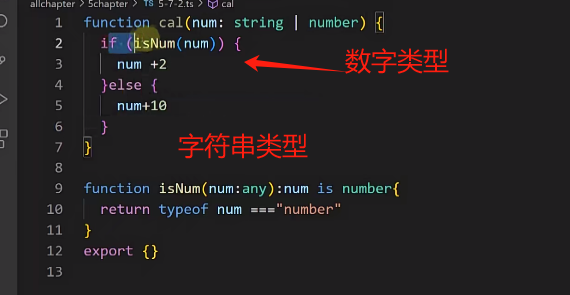

# 深入ts三板斧

## 类型断言、类型转换

### 类型断言

- 语法：`变量 as 类型`

  ```ts
  // Vehicle父类 Car子类
  let car: Vehicle  = new Car();
  let carBrand = (car as Car).carBrand  // 比编译器更知道它为Car类型 父类转换为子类
  ```

- 作用：

  断言为某一类型之后，**就可以使用断言类型上的属性和方法，ts编译器不报错且会给提示**

- 类型断言常用场景：

  - **前提条件：有父子关系的类**

    - 把父类型转换为子类型**【常用】**
    - 把子类型转换为父类型**【不常用】**

    > **在面向对象的语言中，父类类型可以接受子类类型的值**；
    >
    > 注意：父子关系是指二者之间有父子的`extends`关系；如果没有继承关系的两个类相互赋值会报错

  - **场景1：**把父类型转换成子类型

    - 如果不进行断言转换，那么只能使用父类型上的属性和方法，使用子类上的属性和方法报错

    - 进行了断言转换，使用`变量.`语法就能访问子类上的属性和方法，且`ts`编译器有代码提示

    - 举例

      

      - 在上图中，函数形参使用了父类型，而实际调用时会传递子类型，在函数内部想用这个子类型上的属性和内容；
      - 不过上述例子并不好，一般来说，**在函数内部多`if`多分支结合`instanceOf`类型守卫，来使用某一类型上的属性和方法**

      - 一般情况下：**一般都是在函数外部**使用类型断言，只需要访问**这一种类型断言**上的方法或属性。

  - **场景2：**子类型转换成父类型，但是使用不多

    - <font color=red>任何一种类型都可以转换成`any`，因为`any`是任何类型的父类</font>

      

- 注意：

  - 类型断言不能**随意、胡乱断言**，如把一个`string`断言为`number`，`ts`编译器会报错
  - 类型断言一定要<font color=red>前后兼容</font>

### 类型转换

- 作用：和类型断言的作用类似，只是语法不通，使用尖括号

- 举例：

  

## 类型守卫

### `typeof`局限性

- 作用：检测一个变量或对象的数据乐行

- 可以检测的范围：

  - 除了`null`之外的基本类型、函数类型，这些能检测出正常的类型值

  - 其余值均检测为`object`

- 补充：`Object.prototype.toString.call()` 

  - 该方法可以准确检测到`js`所有内置类型`[object xxx]`

  - 但是如果是自定义类，不会显示出准确的自定义类名，只会显示`[object Object]`

> 所以该怎么准确的检测出类型？ 答案：类型守卫

### 类型守卫

- 定义：在语句的块级作用域内【通常是`if`语句内或条目运算符表达式内】缩小变量类型的一种行为。

- 类型守卫产生时机：

  `ts`**条件语句**在遇到以下关键字时，会在语句的块级作用域内缩小变量的类型，这种类型推断的行为称为类型守卫。

  - `instanceOf`: 实例判断，左侧实例对象，右侧类名或构造函数
  - `in`：左侧属性或者方法名，右侧对象
  - `typeof`：右侧写变量， 结合`===`
  - `==`/`===`/`!=`/`!==`

- 作用：类型守卫可以帮助我们在块级作用类获得需要使用的更精确的类型，从而使用该类型上的属性或方法。




### `instanceOf` 

- 语法：左侧变量，右侧类名(es6)或构造函数名(es5)



### `in`

- 语法：左侧是方法或属性，右侧是变量、形参等

  可以访问 包含`in`左侧的属性或方法的类型 上的属性或方法；

  如果有多个类型都有`in`左侧的属性，那么这些类型中定义的方法**全都可以被调用**



### `typeof`

- 语法：左侧实例对象，结合`===`进行判断



### 自定义守卫

- 需求：

  在类型守卫中，如果一个函数支持传入很多中类型，那么就要在函数体中写很多类型守卫，判断很多次，

  是否有什么更加简便的方法优化这些代码？答案：自定义类型守卫

- 语法

  ```ts
  function 函数名(形参: 参数类型): 形参 is A类型 { // 形参处的参数类型大多写为any
  	return true or false
  }
  ```

  - 自定义守卫的函数处传递形参类型一般写作`any`
  - 自定义守卫只要返回`true`，代表这个值的类型就是返回值处`is `后面的类型

  ```ts
  
  // 举例：一般下面的代码都是写在if中进行判断
  // 返回true则告诉ts为 Car类型, 在if接下来的{}中，可以访问Car类型上的属性和方法
  // 返回false则告诉ts为 Car类型, 在if接下来的{}中，可以访问非Car类型上的属性和方法
  function isCar(car: any): car is Car {
      return car instanceOf Car
  }
  ```

- 举例

  

  

  在上图中

  - 第一个`isNum`判断为数值类型，那么接下来的块级作用域可以使用`number`类型的方法

  - 接下来`else`，该形参的类型就只剩下了`string`，因此`else`语句的块级作用域中就只能使用字符串的方法

    

  


