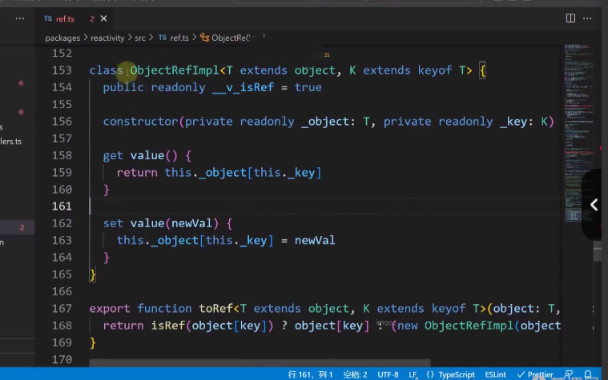

# 泛型

## 泛型介绍

### 泛型特点

- **具有以下特点的数据类型叫泛型**
  - 定义时不确定、使用时必须明确某种具体数据的**数据类型**，<font color=red>泛型本身也是一种数据类型</font>
  - 在编译期间进行数据类型检查。**如果没给具体类型会报错**

### 语法

- 使用`<>`括号**定义泛型**，尖括号的内容**为泛型形参**，有两种表示方法

  - A-Z任一大写字母   【开发时常用】 或  语义化的英文单词【框架底层代码常用】
    - **T**：代表**Type**，定义泛型时通常用作第一个类型变量名称
    - **K**：代表**Key**，表示对象中的**键类型**；
    - **V**：代表**Value**，表示对象中的**值类型**；
    - **E**：代表**Element**，表示的**元素类型**；

  - **经常使用泛型的场景**：
    - 接口`interface`
    - 类`class`
    - 函数`function`及函数表达式
    - 类型`type`

- 使用`<>`定义了泛型形参后，就可以在`{}`中、`()`中、或`=`右侧**需要写类型的地方**使用**泛型形参**

- 举例

  ```ts
  // 1.接口
  interface MyInterface<T> {
      // 在接口内部都可以使用泛型T
      name: T
  }
  let test: MyInterface<string> = { name: "pp" };
  ```

  ```ts
  // 2.类型
  type myType<T> = {
    name: T;
  };
  let test: myType<string> = { name: "pp" };
  ```

  ```ts
  // 3.类
  class MyClass<T> {
      // 在class内部都可以使用泛型T
    name: T
    constructor(value: T) {
      this.name = value;
    }
  }
  let test= new MyClass<string>('pp');
  let test2:MyClass<string>= new MyClass<string>('pp');
  ```

  > **接口的实例化对象类型即为：它所对应的类**

  ```ts
  // 4.函数
  function MyFunction<T>(name:T):T{ 
      return name
  }
  ```

  ```ts
  // 5.函数表达式处;
  // 注意:函数表达式左侧为返回值前=>、右侧也要重新声明的泛型
  // 其实可以不写赋值号右侧匿名函数中的各个类型,因为会自动推导
  // 有泛型写是因为：帮助理解
  const MyFunctionExpression: <T>(name:T) => T = function<T>(name:T):T { 
      return name
  }
  const MyFunctionExpression: <T>(name:T) => T = function(name) { 
      return name
  }
  ```

> **为什么称为泛型形参？**
>
> 因为泛型的形参类似方法的形参，具体的数据类型/数据都是在**调用时传递过来**

> **为什么使用`<>`尖括号表示泛型**
>
> 1.**花括号**被类和函数的体使用  2.**中括号**被数组使用 3. **小括号**被函数参数处使用

## 泛型必要性

- 需求：一个接口中的传入`value`可能是string/number或其他各种类型

- 解决方案1：将`value`写死为`any`类型

  - 特点：
    - `any` 能代表任何数据类型，`ts`编译器不会报错
    - 但**想使用点语法获取`any`类型变量的属性或方法没有任何提示**

  - 代码

    ```ts
    interface Ref{
      value: any,
    }
    
    let ref:Ref= {
      value: {
        name: 'pp',
        age: 24
      }
    }
    // 使用any类型虽然可以接受任何类型
    // 但是继续向下面写,就没有编译器的提示了
    ref.value.
    ```

- 解决方案2：【正解】使用泛型

  - 特点：

    - 可以满足需求，支持传入任何想传入的类型
    - 且使用点语法等有自动提示

  - 代码

    ```ts
    // 使用<>表示泛型
    interface Ref<V>{
      value: V
    }
    let ref:Ref<string> = { // 使用时给泛型传入具体化类型
      value: 'pp'
    }
    
    type Student = { name: string, age: number};
    let ref2:Ref<Student> = {
      value: {
        name: 'pp',
        age: 123
      }
    }
    // 此时再调用时 就有了提示
    ref2.value.name
    ```

    > **注意**
    >
    > - 泛型也是一个类型，在实际调用时只需要传递给泛型形参**一个具体的类型**
    > - 具体的类型：哪怕是`type`/`interface`定义的具体的类型也可以

## 泛型代码举例

```ts
// 模拟arrayList,支持add和get方法
class ArrayList<T>{
  arr: Array<T>;  // 此处使用了泛型形参
  index: number = 0;
  constructor() {
    this.arr = [];
  }
  get(index: number) {
    return this.arr[index];
  }
  add(ele: T){ // 此处使用了泛型形参
    this.arr.push(ele);
  }
}

// 在实际运行时, 传入泛型形参对应的具体类型
// 然后ts会为其后面的操作进行类型检查
const p1 = new ArrayList<string>();
p1.add('123'); // 如果这里传递的不是string 会报错
console.info(p1.get(0));

const p2 = new ArrayList<{name: string, age: number}>();
p2.add({name: 'pp', age: 123})// 不传递 {name: string, age: number} 类型会报错
console.info(p2.get(0))

export {}
```

## 泛型默认值

- 语法：使用`=`语法设置调用时没有传值时，泛型的默认值

```ts
// 模拟arrayList,支持add和get方法
class ArrayList<T=any>{ // 如果不传递给泛型值,那么就会采用等号后的默认值
  arr: Array<T>;
  index: number = 0;
  constructor() {
    this.arr = [];
  }
  get(index: number) {
    return this.arr[index];
  }
  add(ele: T){
    this.arr.push(ele);
  }
}
```

> 如果不使用`=`语法显式设置泛型的默认值，且在调用的时候没有传值给泛型，那么泛型类型为`unkonwn`

## 泛型约束

- 定义：

  - 对泛型的类型进行一定限制，需要其满足一定的条件
  - 而不是随便传递一个**具体类型**过来都可以

- 语法：使用`extends`进行泛型约束

  
  

## 反向推导

- 定义：
  - 如果使用含有泛型的类型时，没有显式写`<具体类型>``
  - ``ts`编译器能够根据传递给函数或变量的实际值，自动推导出泛型类型参数的类型。

- 举例

  ```ts
  // 泛型函数
  function identity<T>(arg: T): T {
    return arg;
  }
  
  // 使用泛型函数并让 TypeScript 推导类型
  let result = identity("Hello");
  // TypeScript 自动推导出 result 的类型为 string
  console.log(result); // Output: Hello
  ```

## 常用技巧

- 泛型可以和其他关键字或工具类型结合，产生非常有用的用法。

### exnteds

- 作用：实现泛型约束，限制传入的具体类型
- 在之前的章节已经讲过，不在赘述

### keyof

- `keyof`作用：获取一个对象、接口的所有`key`的值的字符串组成的联合类型

- 结合泛型：限制传入的 具体的值 为对应的对象、接口上的`key`

- 举例：

  ```ts
  // 泛型中的应用
  // K extends keyof T,限制了传入K的具体类型必须是前面T的键
  const getInfo = <T, K extends keyof T>(data: T, key: K): T[K] => {
      return data[key]
  }
  const info = {
      name: 'pp',
      age: 7,
      sex: true
  }
  
  getInfo(info, 'name'); //ok
  getInfo(info, 'tel'); //error
  ```


### 其他

暂略


**参考文章**

[一篇让你完全够用的TS指南](https://juejin.cn/post/7088304364078497800#heading-11)


