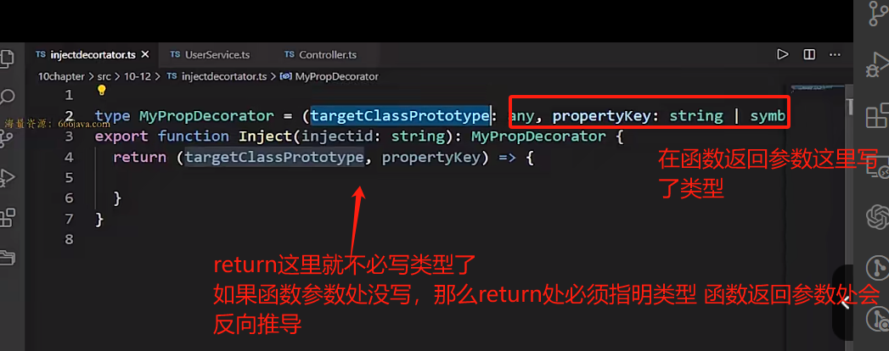
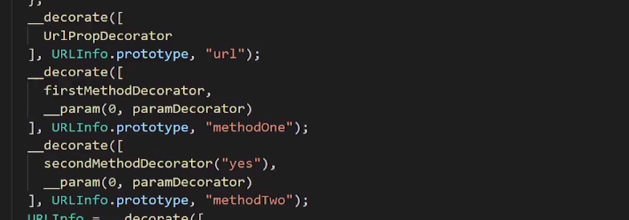
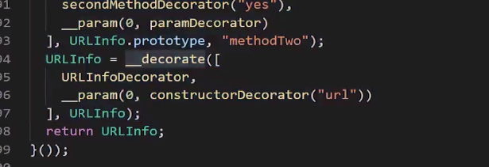

# 装饰器

## 装饰器

- 定义：

  - 是一个<font color=red>方法、函数</font>，可以注入【写到】类、方法、属性、参数、对象上，拓展其功能。

  **了解：高阶组件本质上也是采用了装饰器思想**

- 装饰器要解决的问题：

  - 装饰器就是解决**在不修改原来类、方法、属性、参数**的时候，**增加其额外的功能**

  - 如果用装饰器的话，如果需要修改n个类，**只需要修改一次**

  - 装饰器可以解决**依赖注入的问题**

    <font color=red>**使用和创建分离**是依赖注入的核心思想，依赖注入可以降低项目的耦合性</font>

- 装饰器的分类：

  常用的装饰器：类装饰器、方法装饰器、属性装饰器、参数装饰器、原数据装饰器、元数据装饰器

- 元数据装饰器的初步理解：

  - 定义类、方法、对象的时候，设置一些原数据
  - 是对类、方法、对象的说明
  - 需要引入的第三方库才能使用`@Reflect.metadata`

- 装饰器两种写法

  - 写法一：使用时**不传递参数**的装饰器
  - 写法二：装饰器工厂，使用时**可以传递参数**的装饰器

## 类装饰器

### 环境搭建

- 安装包

  ```sh
  npm i concurrently --prefix . # 支持合并执行脚本命令
  npm i nodemon --prefix . # 监听文件变化,自动重启node服务 提高开发效率
  ```

- 修改配置文件`tsconfig.json`，否则写装饰器`ts`会报错

  

- 配置脚本文件`package.json`

  ```json
  "scripts": {
      "dev:build": "tsc -w",
      "dev:start": "nodemon --watch dist/teaching  js --exec node ./dist/teaching/1ClassDecorator.ts",
      "start": "concurrently npm:dev:*",
      "tsc": "tsc src/teaching/1ClassDecorator.ts --target ES5 -w --experimentalDecorators"
    },
  ```

### 两种类装饰器实现代码

#### 不带参数的类装饰器

- 声明：定义一个函数，必然有一个形参是类本身

- 调用：`@装饰器名` 即为调用

```ts
// 不带参数的类装饰器
function FirstClassDecorator(tagetClass: any) { // tagetClass就是class本身,这个会隐式传递,在@调用处不用写
  let tagetClassObj = new tagetClass();
  tagetClassObj.buy();
  console.log('tagetClass.name',tagetClass.name)
}

// 这是一个不带参数的装饰器
// 是否传递参数不是看装饰器函数中是否有参数
@FirstClassDecorator
class CustomerService {
  name: string = 'pp'
  constructor() {
  }
  buy() {
    console.log(this.name + '购买');
  }
}

export {}
```

#### 传递参数的类装饰器

- 声明：声明一个函数，函数返回值为一个函数（就是不含参数的装饰器函数，必带形参）
- 调用：`@装饰器名(传递的参数)` 即为调用

```ts
// 带参数的类装饰器
function FirstClassDecorator(params: any) {
  console.log(params);
  // 必须返回一个函数,形参对应的实参为：实际传递过来的类
  return function (tagetClass: any) {
    let tagetClassObj = new tagetClass();
    tagetClassObj.buy();
    console.log('tagetClass.name',tagetClass.name)
  }
}

@FirstClassDecorator('我是用来修饰CustomerService类的装饰器参数')
class CustomerService {
  name: string = 'pp'
  constructor() {
  }
  buy() {
    console.log(this.name + '购买');
  }
}

export {}
```

### 类装饰器底层JS源码

#### 不带参数的装饰器

```ts
"use strict";
// 不含参数装饰器
// 首次调用时执行||后面的函数; 二次调用时,直接使用this.__decorate
var __decorate = (this && this.__decorate)  
|| function (decorators, target, key, desc) {
    // c: arguments.length, 
    // 作用：根据长度判断装饰器修饰的目标是什么,可以获取目标哪些信息
    // arguments.length == 2, 修饰类或构造器参数
    // arguments.length == 3, 修饰方法参数或属性
    // arguments.length == 4, 修饰方法
    var c = arguments.length 
    // r: targetInfo, arguments.length == 2时 r为被修饰的类
    // r: targetInfo, arguments.length == 3时 r为被undefined 不做任何处理
    // r: targetInfo, arguments.length == 4时 r为被修饰方法的所有数据属性
    var r = c < 3 ? target : desc === null ? desc = Object.getOwnPropertyDescriptor(target, key) : desc, d;
    // decorators形参 整个装饰器数组
    // decorate变量 用来保存装饰器数组中的每一个元素,逐步迭代 
    // if中内容 元数据信息
    if (typeof Reflect === "object" && typeof Reflect.decorate === "function") r = Reflect.decorate(decorators, target, key, desc);
    else {
      // 装饰器倒着循环,说明一个目标上有多个装饰器,执行顺序【从后面开始执行】
      for (var i = decorators.length - 1; i >= 0; i--) {
        if (d = decorators[i]) { 
          // r: targetInfo 
          // c (arguments.length) == 2, decorate为 类装饰器或构造函数装饰器 执行该decorate(targetInfo) => 就是将这个类传进当前装饰器
          // c (arguments.length) == 3, decorate为 方法参数或属性装饰器, 执行
          // c (arguments.length) == 4, decorate为 方法装饰器, 执行
          // 返回值：当c==2时,若d(r)装饰器函数若没有写return, 此时进入 || r,返回r即为目标类
          r = (c < 3 ? d(r) : c > 3 ? d(target, key, r) : d(target, key)) || r;
        }
      }
    }
    // 修饰目标为方法
    return c > 3 && r && Object.defineProperty(target, key, r), r;
};


var __metadata = (this && this.__metadata) || function (k, v) {
    if (typeof Reflect === "object" && typeof Reflect.metadata === "function") return Reflect.metadata(k, v);
};
Object.defineProperty(exports, "__esModule", { value: true });


// tagetClass就是class本身
// 类装饰器：就是把这个类交给装饰器
function FirstClassDecorator(tagetClass) {
    var tagetClassObj = new tagetClass();
    tagetClassObj.buy();
    console.log('tagetClass.name', tagetClass.name);
}


// 这是一个不带参数的装饰器
// 是否传递参数不是看装饰器函数中是否有参数
var CustomerService = /** @class */ (function () {
    function CustomerService() {
        this.name = 'pp';
    }
    CustomerService.prototype.buy = function () {
        console.log(this.name + '购买');
    };
    // __decorate函数可以接受4个参数decorators, target, key, desc
    // 第一个参数：装饰器数组。因为可能被多个装饰器修饰,所以为数组
    // 第二个参数：此处为被修饰的类
    // 第三个参数：修饰类时为空
    // 第四个参数：修饰类时为空 
    // 返回值：若装饰类函数没有写return,此时返回值就是他自己
    CustomerService = __decorate([
        FirstClassDecorator,
        __metadata("design:paramtypes", [])
    ], CustomerService);
    return CustomerService;
}());

```

#### 带参数的类装饰器

```ts
"use strict";
var __decorate = (this && this.__decorate) || function (decorators, target, key, desc) {
    var c = arguments.length, r = c < 3 ? target : desc === null ? desc = Object.getOwnPropertyDescriptor(target, key) : desc, d;
    if (typeof Reflect === "object" && typeof Reflect.decorate === "function") r = Reflect.decorate(decorators, target, key, desc);
    else for (var i = decorators.length - 1; i >= 0; i--) if (d = decorators[i]) r = (c < 3 ? d(r) : c > 3 ? d(target, key, r) : d(target, key)) || r;
    return c > 3 && r && Object.defineProperty(target, key, r), r;
};
var __metadata = (this && this.__metadata) || function (k, v) {
    if (typeof Reflect === "object" && typeof Reflect.metadata === "function") return Reflect.metadata(k, v);
};
Object.defineProperty(exports, "__esModule", { value: true });
// 带参数的类装饰器
function FirstClassDecorator(params) {
    console.log(params);
    return function (tagetClass) {
        var tagetClassObj = new tagetClass();
        tagetClassObj.buy();
        console.log('tagetClass.name', tagetClass.name);
    };
}
var CustomerService = /** @class */ (function () {
    function CustomerService() {
        this.name = 'pp';
    }
    CustomerService.prototype.buy = function () {
        console.log(this.name + '购买');
    };
    CustomerService = __decorate([
        // 带参数的装饰器：和不带参数的装饰器只有这里有区别
        // 拿到带参数的装饰器后,会首先在这里首先执行一边, 等待执行完毕
        // 执行完毕后,拿到返回值,将返回值(函数)作为放在这个数组中
        // 等待所有都执行完毕和返回值参数后, 执行__decorate
        // 最终的装饰器就是：return后返回的函数
        FirstClassDecorator('我是用来修饰CustomerService类的装饰器参数'),
        __metadata("design:paramtypes", [])
    ], CustomerService);
    return CustomerService;
}());

```

>**总结**
>
>- 多个装饰器的执行顺序：从后向前
>- 带参数的装饰器函数：会先执行一遍这个函数
>- 给**装饰器函数decorate**传递的参数：为一个类，所以类型支持any、构造函数类型或typeof 类名

### 泛型工厂 类继承装饰器


### 匿名类装饰器

匿名类

代码有一些区别

### 其他知识点

#### 知识点总结

- 类具有双重性质：作为类型、作为构造函数对象变量

  变量是可以互相赋值的，**但是前提ts要知道赋值号右侧是一个变量**

  在`ts`中可以使用变量声明语句`let classCopy = ClassName`显示指明`classCopy `是类构造函数对象变量变量，不让`ts`迷惑,之后就可以在给`classCopy` 赋值，且存在如下关系，`classCopy  === ClassName`

- 毫不相干的两个类也可以相互赋值：

  只要保证右侧的类包含左侧的类全部的属性（和函数的包含范围相反）

- 一定可以赋值的两个类：

  具有`extends`关系的类，子类一定可以复制给父类；子类必定包含父类的属性和方法。

  **多态：一个父类的类型可以接受一个子类的参数**

- 泛型`T`：

  在使用的时候，泛型T就变成传入的变量实际类型。

- 函数传递参数时（不说泛型）：

  - 情况：如果形参的类型不等于实参类型，但是可以接受时：函数体中变量类型就是在**形参处声明的类型**，而不会变为**实参的类型**。

    **经过形参的处理，类型已经强行变成了any类型**

  - 举例：形参处是`x:any`，传递了一个数字类型实参，在函数体中`x`依旧为`any`类型，获取不到`number`类型上的方法

  - 某个解决方法：**想要获取形参类型上的属性或方法就要使用类型断言`as xxx`**

## 方法装饰器

### 方法装饰器实现

#### 不带参数方法装饰器

```ts
/**
 * 不带参数方法装饰器
 * @param targetClassPrototype 类的原型[RoleService.prototype]
 * @param methodname 方法名
 * @param methodDecri 方法的数据属性
 */
function MyMethodDecorator(targetClassPrototype: any, methodname:string, methodDescriptor: PropertyDescriptor) {
  console.log('targetClassPrototype:',targetClassPrototype)
  console.log('methodname:',methodname)
  console.log('methodDecri:',methodDescriptor)
  // 可以直接在执行器中执行原方法;
  methodDescriptor.value();
}

// 目标类
class RoleService {
  public roleName: string = '管理员'
  constructor (){
  }
  // 调用方法拦截器
  @MyMethodDecorator
  DistributeRoles() {
    console.info('分配角色中');
  }
}


```

#### 带参数的方法装饰器

```ts
/**
 * 带参数的方法装饰器
 * @param targetClassPrototype 类的原型[RoleService.prototype]
 * @param methodname 方法名
 * @param methodDecri 方法的数据属性
 */
function MyMethodDecorator(params: any){
  console.log('传递进来的参数', params);
  return function(targetClassPrototype: any, methodname:string, methodDescriptor: PropertyDescriptor) {
    console.log('targetClassPrototype:',targetClassPrototype)
    console.log('methodname:',methodname)
    console.log('methodDecri:',methodDescriptor)
    // 可以直接在执行器中执行原方法;
    methodDescriptor.value();
  }
}

// 目标类
class RoleService {
  public roleName: string = '管理员'
  constructor (){
  }
  // 调用方法拦截器
  @MyMethodDecorator('哈哈')
  DistributeRoles() {
    console.info('分配角色中');
  }
}

export {}

```

### 方法装饰器底层JS源码

略

### 方法装饰器应用——拦截器

```ts
/**
 * 带参数的方法装饰器
 * @param targetClassPrototype 类的原型[RoleService.prototype]
 * @param methodname 方法名
 * @param methodDecri 方法的数据属性
 */
function MyMethodDecorator(params: any){
  return function(targetClassPrototype: any, methodname:string, dataProps: PropertyDescriptor) {
    const targetMethod = dataProps.value;
    dataProps.value = function(...args: any[]) {
      console.info('前置拦截...');
      console.info(...args);
      // 注意:这里由于由嵌套了一层,所以要在此处调用;
      // 原方法：真正的执行
      targetMethod.apply(this, args);
      console.info('后置拦截...');
    }
    dataProps.enumerable = false;
  }
}

// 目标类
class RoleService {
  public roleName: string = '管理员'
  constructor (){
  }
  // 调用方法拦截器
  @MyMethodDecorator('**带参数的方法装饰器**')
  DistributeRoles(name: string, age: number) {
    console.info('分配角色中...');
  }
}

const testInstance = new RoleService();
// 调用这个方法
testInstance.DistributeRoles('pp', 22);
console.info(Object.getOwnPropertyDescriptor(RoleService.prototype, 'DistributeRoles'))
export {}


```

> 引用类型作为参数传递到函数中，在函数中修改该引用类型的属性，原对象也会发生改变。

## 属性装饰器

### 属性装饰器实现

```ts
function loginProperty(attrValue: any) {
  return function(targetPrototype: any, attrName: string | symbol) {
    console.log(targetPrototype);
    console.log(attrName);
    targetPrototype.constructor.custLevelDescri = function() {
      console.log('消费500升级svip');
    }
    console.log( targetPrototype.constructor.custLevelDescri());
  }
}


class Person {
  public name: string = "pp"
  @loginProperty('顾客等级')
  public degree!:string 
  constructor() {
  }
}
```

### 属性装饰器底层JS源码

```ts
"use strict";
// 参数装饰器
var __decorate = (this && this.__decorate) || function (decorators, target, key, desc) {
    // c: 参数个数
    // r: targetInfo
    // c == 3 执行desc r值为undefined
    // c == 4 执行desc r值为undefined
    var c = arguments.length
    var r = c < 3 ? target : desc === null ? desc = Object.getOwnPropertyDescriptor(target, key) : desc, d;

    if (typeof Reflect === "object" && typeof Reflect.decorate === "function") r = Reflect.decorate(decorators, target, key, desc);
    else {
      for (var i = decorators.length - 1; i >= 0; i--) {
        if (d = decorators[i]) {
          // c == 3 执行d(target, key) 若装饰器没写return, => 则 r = r 还是undefined
          // c == 4 执行d(target, key, r===undefined) 若装饰器没写return, => 则 r = r 还是undefined
          r = (c < 3 ? d(r) : c > 3 ? d(target, key, r) : d(target, key)) || r;
        }
      }
    }
    // c == 3 第一个条件就终止
    // c == 4 第二个条件就终止 r为undefined
    return c > 3 && r && Object.defineProperty(target, key, r), r;
};
var __metadata = (this && this.__metadata) || function (k, v) {
    if (typeof Reflect === "object" && typeof Reflect.metadata === "function") return Reflect.metadata(k, v);
};
function loginProperty(attrValue) {
    return function (targetPrototype, attrName) {
        console.log(targetPrototype);
        console.log(attrName);
        targetPrototype.constructor.custLevelDescri = function () {
            console.log('消费500升级svip');
        };
        console.log(targetPrototype.custLevelDescri);
    };
}
var Person = /** @class */ (function () {
    function Person() {
        this.name = "pp";
    }
    /**
     * 此处有4个或3个参数
     * 1. 装饰器数组
     * 2. 属性所在原型对象
     * 3. 属性名
     * 4. 根据控制台编译命令不同, 
     *    第四个参数可能为void 0, 或者没有第4个参数;
     *    但是二者的运行结果都是一样的,在代码中做了处理
     */
    __decorate([
        loginProperty('顾客等级'),
        __metadata("design:type", String)
    ], Person.prototype, "degree", void 0);
    return Person;
}());

```


## 综合应用

使用到的内容：依赖注入 + 请求方法 + 控制器初步实现

- 集合类
  - 集合类使用单件模式
- 业务类
  - 根据用户功能划分
- 控制类
  - 依赖注入
  - 其他控制操作

元数据：类、属性、方法上，理解为数据的数据，实现特定的功能

分类：内置原数据、自定义元数据（第三方包）




## 参数装饰器

### 参数装饰器实现

#### 普通函数参数装饰器

```ts
function UrlParma(params:string){
  return function(targetClassPrototype: any, methodaname: string, paramindex: number) {
    console.info(targetClassPrototype)
    console.info(methodaname)
    console.info(paramindex) // 修饰的参数是第几个参数,从0开始
    targetClassPrototype.info = params;
  }
}

class People {
  eat(@UrlParma('参数具体信息') name: string, @UrlParma('参数具体信息') addr: string) {
    console.log(name,addr)
  }
}
```

#### 构造函数参数装饰器

```ts
import { UserService } from "./12-综合应用/UserService";
import "reflect-metadata"

type myParamDecorator = (target: object, paramname: string | symbol | undefined, index: number) => void
export function InjectConstructor(injectid?: string): myParamDecorator{
  // 第一个参数不再是原型,而是一个类
  return (targetClass, paramname, paramindex) => {
    console.info(targetClass)
    console.info(paramname)
    console.info(paramindex)
    // 获取该构造函数上所有参数的类型
    let paramArr = Reflect.getMetadata('design:paramtypes', targetClass)
    console.info(paramArr);
    // 获取被修饰的参数的类型, 它是一个类,因此可以执行new
    let constrParamArrobj = new paramArr[paramindex]();
  }
}
```

### 参数装饰器底层源码

```ts
"use strict";
var __decorate = (this && this.__decorate) || function (decorators, target, key, desc) {
    var c = arguments.length
    console.info('c', c)
    var r = c < 3 ? target : desc === null ? desc = Object.getOwnPropertyDescriptor(target, key) : desc, d;
    console.info('r', r); // r的值为修饰参数所在的方法
    if (typeof Reflect === "object" && typeof Reflect.decorate === "function") r = Reflect.decorate(decorators, target, key, desc);
    // 执行 d(target, key), 即执行__param函数
    else for (var i = decorators.length - 1; i >= 0; i--) if (d = decorators[i]) r = (c < 3 ? d(r) : c > 3 ? d(target, key, r) : d(target, key)) || r;
    // 返回r，r为被修饰属性所在的方法的数据属性
    return c > 3 && r && Object.defineProperty(target, key, r), r;
};
var __metadata = (this && this.__metadata) || function (k, v) {
    if (typeof Reflect === "object" && typeof Reflect.metadata === "function") return Reflect.metadata(k, v);
};
// __param(0, UrlParma('参数具体信息'))
// 第一个参数: 装饰器修饰的参数位置, 由于闭包该paramIndex参数不会被释放
// 第二个参数：传递进来的真正的装饰器函数(在外部定义好了 目标原型、方法名、位置)
// 返回值：重新返回装饰器函数,只需要传递目标和方法名
var __param = (this && this.__param) || function (paramIndex, decorator) {
    return function (target, key) { decorator(target, key, paramIndex); }
};
function UrlParma(params) {
    return function (targetClassPrototype, methodaname, paramindex) {
        console.info(targetClassPrototype);
        console.info(methodaname);
        console.info(paramindex); // 修饰的参数是第几个参数,从0开始
        targetClassPrototype.info = params;
    };
}
var People = /** @class */ (function () {
    function People() {
    }
    People.prototype.eat = function (name, addr) {
        console.log(name, addr);
    };
    // 4个参数
    // 第一个参数比其他装饰器多一个环节： 
    //   1.带参的装饰器, 整个装饰器函数执行,返回值为真正的装饰器函数,交给__param
    //   2.执行__param
    __decorate([
        __param(0, UrlParma('参数具体信息')),
        __param(1, UrlParma('参数具体信息')),
        __metadata("design:type", Function),
        __metadata("design:paramtypes", [String, String]),
        __metadata("design:returntype", void 0)
    ], People.prototype, "eat", null);
    return People;
}());

```

## 组合装饰器

### 执行顺序

> 属性装饰器 --> 第一个方法的参数装饰器 --> 第一个方法的方法装饰器 --> ... --> 构造函数参数装饰器 --> 类装饰器

### JS底层源码变化

- 在``__decorate`处变化，其他地方基本不变

  - 每个方法的参数装饰器和方法装饰器写在同一个`__decorate`函数中

    方法装饰器写在前面，参数装饰器写在后面，因此先执行参数装饰器

    

  - 类的构造器参数装饰器和类装饰器写在一个`__decorate`函数中

    类装饰器写在函数，构造函数参数装饰器写在后面，因此构造函数参数装饰器先执行

  

## 元数据

### 元数据基本介绍

- 定义：附加在对象、类、方法、属性上的数据
- 作用：可以**提供实现某种业务功能**需要用的数据
- 底层实现：
  - `ts`底层实现时，原数据都是一些重载的方法，支持不同参数的输入

### 元数据操作

#### 对象和对象属性使上用原数据

```ts
// 在对象和对象属性上使用元数据
import 'reflect-metadata'
let obj = {
  name: 'pp',
  age: 24,
  info() {
    console.log('信息:', name);
  }
}
// 1.在对象上 定义和获取元数据
Reflect.defineMetadata('ppMeta', '我是对象元数据', obj);
console.log(Reflect.getMetadata('ppMeta', obj));
// 2.在对象属性上 定义和获取元数据
Reflect.defineMetadata('ppMeta2','对象属性元数据',obj,'age');
console.info(Reflect.getMetadata('ppMeta2',obj,'age'));

// 注意在对象属性上定义元数据
//   不会修改对象属性的value值
//   不会修改getOwnPropertyDescriptor的数据
// 总结：只能通过 'reflect-metadata' 包提供的方法获取
console.info(obj)
console.info(Object.getOwnPropertyDescriptor(obj,'name')) 

// 查看是否存在元数据,返回Boolean
console.info(Reflect.hasMetadata('ppMeta2', obj))
console.info(Reflect.hasMetadata('ppMeta2', obj,'age'))
```

#### 类、方法上使用原数据

> 大部分情况下并不会在类和方法中这么做

```ts
// 类上使用元数据
import 'reflect-metadata'

// 1.类上定义元数据
// 可以直接使用@Reflect.metadata语法
// 不用写define,且只需要指定key和value
@Reflect.metadata('lei', '地球人')
class People {
  @Reflect.metadata('shuxing', '名字')
  username: string = 'pp'
  @Reflect.metadata('fangfa', '吃泰餐')
  eat() {

  }
}
class ChinesePeople extends People {

}
// 2.获取类上定义的元数据
console.info(Reflect.getMetadata('lei',People))
console.info(Reflect.getMetadata('shuxing',People.prototype,'username'))
console.info(Reflect.getMetadata('fangfa',People.prototype,'eat'))

// 3.判断类上是否包含某个元数据(包含继承)
console.info(Reflect.hasMetadata('lei',People))
console.info(Reflect.hasMetadata('shuxing',People.prototype,'username'))
console.info(Reflect.hasMetadata('fangfa',People.prototype,'eat'))

// 4.判断是否为自有元数据
console.info(Reflect.hasMetadata('fangfa',ChinesePeople.prototype,'eat'))
console.info(Reflect.hasOwnMetadata('fangfa',ChinesePeople.prototype,'eat'))

```

#### 类属性上使用原数据

- 在上一章节已经应用过，略。

- 补充`api`

  - `Reflect.getMetadataKeys` 获取自身和原型链上所有定义的元数据的`Key`数组

  - `Reflect.getOwnMetadataKeys `获取自身上所有定义的元数据的`key`的数组

#### 装饰器内部为类、方法、属性上使用原数据

在综合应用处讲解过，略

#### metakey相同,是否会覆盖？

定义在不同属性、对象、类上的相同的`metakey`不会覆盖。

### 三个重要特殊的内置原数据

- `design:returntype`：修饰的方法返回值的类型
- `design:paramtypes`：修饰的方法参数的类型的数组
- `design:type`：修饰的属性、方法、类的类型

