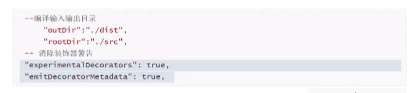

# 装饰器

## 装饰器

- 定义：

  - 是一个<font color=red>方法、函数</font>，可以注入【写到】类、方法、属性、参数、对象上，拓展其功能。

  **了解：高阶组件本质上也是采用了装饰器思想**

- 装饰器要解决的问题：

  - 装饰器就是解决**在不修改原来类、方法、属性、参数**的时候，**增加其额外的功能**

  - 如果用装饰器的话，如果需要修改n个类，**只需要修改一次**

  - 装饰器可以解决**依赖注入的问题**

    <font color=red>**使用和创建分离**是依赖注入的核心思想，依赖注入可以降低项目的耦合性</font>

- 装饰器的分类：

  常用的装饰器：类装饰器、方法装饰器、属性装饰器、参数装饰器、原数据装饰器、元数据装饰器

- 原数据装饰器的初步理解：

  - 定义类、方法、对象的时候，设置一些原数据
  - 是对类、方法、对象的说明
  - 需要引入的第三方库才能使用`@Reflect.metadata`

- 装饰器两种写法

  - 写法一：使用时**不传递参数**的装饰器
  - 写法二：装饰器工厂，使用时**可以传递参数**的装饰器

## 类装饰器

- 类装饰器：就是把这个类交给装饰器

- 环境搭建

  - 安装包

    ```sh
    npm i concurrently --prefix . # 支持合并执行脚本命令
    npm i nodemon --prefix . # 监听文件变化,自动重启node服务 提高开发效率
    ```

  - 修改配置文件`tsconfig.json`，否则写装饰器`ts`会报错

    

  - 配置脚本文件`package.json`

    ```json
    "scripts": {
        "dev:build": "tsc -w",
        "dev:start": "nodemon --watch dist/teaching  js --exec node ./dist/teaching/1ClassDecorator.ts",
        "start": "concurrently npm:dev:*",
        "tsc": "tsc src/teaching/1ClassDecorator.ts --target ES5 -w --experimentalDecorators"
      },
    ```

- 编写两种类装饰器

  - 不带参数的类装饰器

    - 声明：定义一个函数，必然有一个形参是类本身

    - 调用：`@装饰器名` 即为调用

    ```ts
    // 不带参数的类装饰器
    function FirstClassDecorator(tagetClass: any) { // tagetClass就是class本身,这个会隐式传递,在@调用处不用写
      let tagetClassObj = new tagetClass();
      tagetClassObj.buy();
      console.log('tagetClass.name',tagetClass.name)
    }
    
    // 这是一个不带参数的装饰器
    // 是否传递参数不是看装饰器函数中是否有参数
    @FirstClassDecorator
    class CustomerService {
      name: string = 'pp'
      constructor() {
      }
      buy() {
        console.log(this.name + '购买');
      }
    }
    
    export {}
    ```

  - 传递参数的类装饰器

    - 声明：声明一个函数，函数返回值为一个函数（就是不含参数的装饰器函数，必带形参）
    - 调用：`@装饰器名(传递的参数)` 即为调用

    ```ts
    // 带参数的类装饰器
    function FirstClassDecorator(params: any) {
      console.log(params);
      // 必须返回一个函数,形参对应的实参为：实际传递过来的类
      return function (tagetClass: any) {
        let tagetClassObj = new tagetClass();
        tagetClassObj.buy();
        console.log('tagetClass.name',tagetClass.name)
      }
    }
    
    @FirstClassDecorator('我是用来修饰CustomerService类的装饰器参数')
    class CustomerService {
      name: string = 'pp'
      constructor() {
      }
      buy() {
        console.log(this.name + '购买');
      }
    }
    
    export {}
    ```

## 类装饰器底层JS源码

### 不带参数的装饰器

```ts
"use strict";
// 不含参数装饰器
// 首次调用时执行||后面的函数; 二次调用时,直接使用this.__decorate
var __decorate = (this && this.__decorate)  
|| function (decorators, target, key, desc) {
    // c: arguments.length, 
    // 作用：根据长度判断装饰器修饰的目标是什么,可以获取目标哪些信息
    // arguments.length == 2, 修饰类或构造器参数
    // arguments.length == 3, 修饰方法参数或属性
    // arguments.length == 4, 修饰方法
    var c = arguments.length 
    // r: targetInfo, arguments.length == 2时 r为被修饰的类
    // r: targetInfo, arguments.length == 3时 r为被undefined 不做任何处理
    // r: targetInfo, arguments.length == 4时 r为被修饰方法的所有数据属性
    var r = c < 3 ? target : desc === null ? desc = Object.getOwnPropertyDescriptor(target, key) : desc, d;
    // decorators形参 整个装饰器数组
    // decorate变量 用来保存装饰器数组中的每一个元素,逐步迭代 
    // if中内容 元数据信息
    if (typeof Reflect === "object" && typeof Reflect.decorate === "function") r = Reflect.decorate(decorators, target, key, desc);
    else {
      // 装饰器倒着循环,说明一个目标上有多个装饰器,执行顺序【从后面开始执行】
      for (var i = decorators.length - 1; i >= 0; i--) {
        if (d = decorators[i]) { 
          // r: targetInfo 
          // c (arguments.length) == 2, decorate为 类装饰器或构造函数装饰器 执行该decorate(targetInfo) => 就是将这个类传进当前装饰器
          // c (arguments.length) == 3, decorate为 方法参数或属性装饰器, 执行
          // c (arguments.length) == 4, decorate为 方法装饰器, 执行
          // 返回值：当c==2时,若d(r)装饰器函数若没有写return, 此时进入 || r,返回r即被修饰的目标
          r = (c < 3 ? d(r) : c > 3 ? d(target, key, r) : d(target, key)) || r;
        }
      }
    }
    // 修饰目标为方法
    return c > 3 && r && Object.defineProperty(target, key, r), r;
};
var __metadata = (this && this.__metadata) || function (k, v) {
    if (typeof Reflect === "object" && typeof Reflect.metadata === "function") return Reflect.metadata(k, v);
};
Object.defineProperty(exports, "__esModule", { value: true });
// tagetClass就是class本身
// 类装饰器：就是把这个类交给装饰器
function FirstClassDecorator(tagetClass) {
    var tagetClassObj = new tagetClass();
    tagetClassObj.buy();
    console.log('tagetClass.name', tagetClass.name);
}
// 这是一个不带参数的装饰器
// 是否传递参数不是看装饰器函数中是否有参数
var CustomerService = /** @class */ (function () {
    function CustomerService() {
        this.name = 'pp';
    }
    CustomerService.prototype.buy = function () {
        console.log(this.name + '购买');
    };
    // __decorate函数可以接受4个参数decorators, target, key, desc
    // 第一个参数：装饰器数组。因为可能被多个装饰器修饰,所以为数组
    // 第二个参数：此处为被修饰的类
    // 第三个参数：修饰类时为空
    // 第四个参数：修饰类时为空 
    // 返回值：若装饰类函数没有写return,此时返回值就是他自己
    CustomerService = __decorate([
        FirstClassDecorator,
        __metadata("design:paramtypes", [])
    ], CustomerService);
    return CustomerService;
}());

```

### 带参数的装饰器

```ts
"use strict";
var __decorate = (this && this.__decorate) || function (decorators, target, key, desc) {
    var c = arguments.length, r = c < 3 ? target : desc === null ? desc = Object.getOwnPropertyDescriptor(target, key) : desc, d;
    if (typeof Reflect === "object" && typeof Reflect.decorate === "function") r = Reflect.decorate(decorators, target, key, desc);
    else for (var i = decorators.length - 1; i >= 0; i--) if (d = decorators[i]) r = (c < 3 ? d(r) : c > 3 ? d(target, key, r) : d(target, key)) || r;
    return c > 3 && r && Object.defineProperty(target, key, r), r;
};
var __metadata = (this && this.__metadata) || function (k, v) {
    if (typeof Reflect === "object" && typeof Reflect.metadata === "function") return Reflect.metadata(k, v);
};
Object.defineProperty(exports, "__esModule", { value: true });
// 带参数的类装饰器
function FirstClassDecorator(params) {
    console.log(params);
    return function (tagetClass) {
        var tagetClassObj = new tagetClass();
        tagetClassObj.buy();
        console.log('tagetClass.name', tagetClass.name);
    };
}
var CustomerService = /** @class */ (function () {
    function CustomerService() {
        this.name = 'pp';
    }
    CustomerService.prototype.buy = function () {
        console.log(this.name + '购买');
    };
    CustomerService = __decorate([
        // 带参数的装饰器：和不带参数的装饰器只有这里有区别
        // 拿到带参数的装饰器后,会首先在这里首先执行一边, 等待执行完毕
        // 执行完毕后,拿到返回值,将返回值(函数)作为放在这个数组中
        // 等待所有都执行完毕和返回值参数后, 执行__decorate
        // 最终的装饰器就是：return后返回的函数
        FirstClassDecorator('我是用来修饰CustomerService类的装饰器参数'),
        __metadata("design:paramtypes", [])
    ], CustomerService);
    return CustomerService;
}());

```

>**总结**
>
>- 多个装饰器的执行顺序：从后向前
>- 带参数的装饰器函数：会先执行一遍这个函数
>- 给装饰器函数传递的参数：为一个类，所以类型支持any、构造函数类型或typeof 类名


